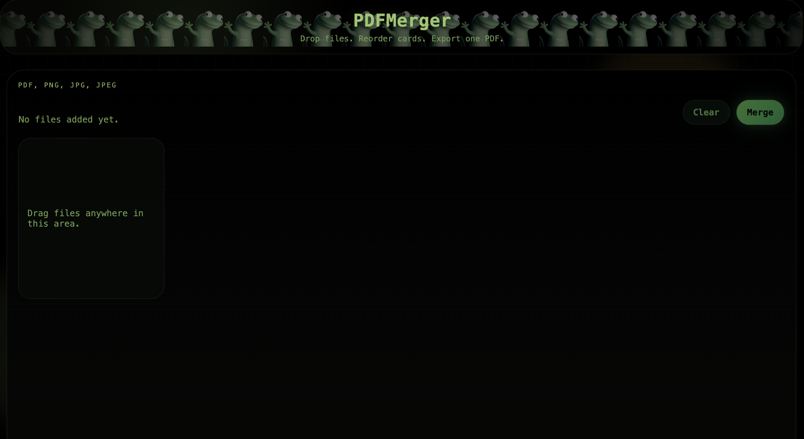

# PDF Merger Studio

Static browser app for dragging in `PDF`, `PNG`, `JPG`, and `JPEG` files, previewing them in order, and downloading them as a single merged PDF.

## PDFMerger_Screen



## Gecko Wall

<p>
  
  
  
  
  
  
</p>

## Local Run

This is a static app, so any simple web server works.

```bash
python3 -m http.server 8000
```

Open `http://localhost:8000` in your browser.

## Docker Compose

This repo includes a container build and a `compose` file so a teammate can pull the repo and run it immediately.

### Requirements

- Docker Desktop or Docker Engine
- Docker Compose v2

### Start

```bash
docker compose up --build
```

Open `http://localhost:38481` in your browser.

### Detached Mode

```bash
docker compose up --build -d
```

### Stop

```bash
docker compose down
```

### Rebuild After Changes

```bash
docker compose up --build
```

## Team Workflow

After cloning or pulling the latest changes:

```bash
git pull
docker compose up --build
```

Then open `http://localhost:38481`.

## Features

- Drag and drop or click to upload
- Keep the exact drop order
- Preview first PDF page or image thumbnail
- Remove files individually
- Merge mixed PDFs and images
- Download a single PDF

## More Gecko

<p>
  
  
  
  
  
</p>
